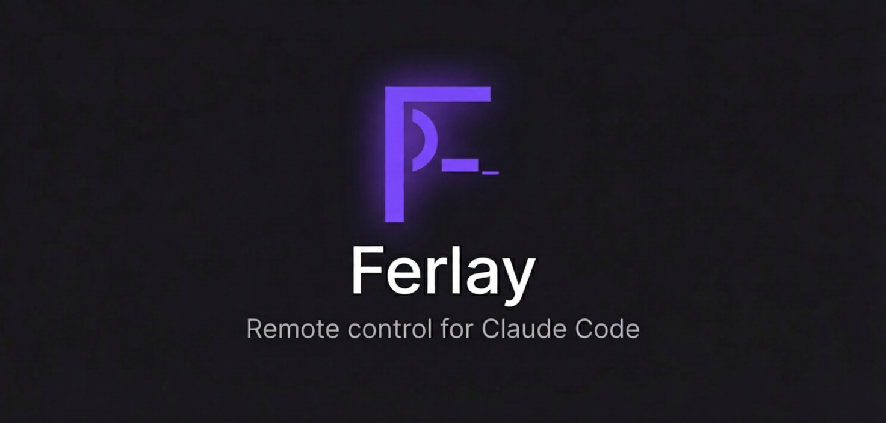

<p align="center">
  
</p>

<p align="center">
  <a href="https://github.com/y0sif/ferlay/releases"></a>
  <a href="https://github.com/y0sif/ferlay/actions"></a>
  <a href="LICENSE"></a>
</p>

---

> [!WARNING]
> **Ferlay is archived and no longer maintained (August 2026).**
>
> Claude Code ships this natively now. Use `claude remote-control` for a persistent
> server that accepts sessions from the Claude mobile app and claude.ai/code, or
> `claude self-hosted-runner` to run sessions on your own machines. See the
> [Remote Control docs](https://code.claude.com/docs/en/remote-control).
>
> The hosted relay at `relay.ferlay.dev` has been shut down, so existing installs
> can no longer connect. The relay is MIT licensed and self-hostable if you want to
> run your own: see [docs/self-hosting.md](docs/self-hosting.md).
>
> Everything below is left intact as a reference.

**Start, manage, and approve Claude Code sessions from your phone.** Spin up coding sessions, approve tool-use prompts, and monitor progress - all from anywhere.

One command to install, pair, and go.

## Install

### Linux / macOS

```sh
curl -sSL https://y0sif.github.io/ferlay/install.sh | sh
```

### Windows

```powershell
irm https://y0sif.github.io/ferlay/install.ps1 | iex
```

The installer downloads the daemon, then runs `ferlay setup` which walks you through:
1. **Relay configuration** - enter the URL of a relay you host yourself (the hosted relay is shut down)
2. **Pairing** - displays a QR code, scan it with the Ferlay app
3. **Background service** - installs and starts the daemon (systemd on Linux, launchd on macOS, Task Scheduler on Windows)

After setup, the daemon runs in the background and starts automatically on login. That's it.

<details>
<summary><b>Other install methods (AUR, Homebrew, from source)</b></summary>

### Arch Linux (AUR)

```sh
yay -S ferlay-bin
```

### Homebrew (macOS)

```sh
brew install y0sif/tap/ferlay
```

### From source

```sh
cargo install --path daemon
ferlay setup
```

</details>

## Get the App

| Platform | Link |
|----------|------|
| Android (APK) | [Latest release](https://github.com/y0sif/ferlay/releases/latest) |
| iOS      | Coming soon |

---

## How It Works

```
Phone App  <-->  Relay Server  <-->  Daemon  <-->  Claude Code
                 (self-hosted)       (your machine)
```

1. **Daemon** runs on your computer, manages Claude Code sessions
2. **Relay** routes encrypted messages between your phone and daemon
3. **App** on your phone - scan QR to pair, tap to start sessions

All communication is **end-to-end encrypted** (X25519 + AES-256-GCM). The relay only forwards opaque ciphertext.

---

<details>
<summary><b>Self-hosted relay</b></summary>

Run your own relay for full infrastructure control. No database, no external dependencies.

```sh
# Docker
docker run -d -p 8080:8080 ghcr.io/y0sif/ferlay-relay:latest

# Or from source
cargo run -p ferlay-relay
```

Point your daemon at it:

```sh
ferlay config set relay-url wss://your-relay.example.com/ws
```

For production TLS, the `deploy/` directory has ready-made configs for Cloudflare Tunnel, Caddy (auto-TLS), and nginx.

</details>

<details>
<summary><b>Local mode</b></summary>

For development or same-network use. Runs a local relay and daemon together, no external server.

```sh
ferlay daemon --local
```

Or use the dev script:

```sh
./scripts/ferlay-local.sh        # Linux/macOS
./scripts/ferlay-local.ps1       # Windows
```

</details>

---

## CLI Reference

```
ferlay setup                                           Interactive setup (relay, pairing, auto-start)
ferlay daemon [--local] [--relay <URL>] [--re-pair]    Start the daemon in foreground
ferlay pair                                            Re-pair with a new phone
ferlay status                                          Check daemon health
ferlay config show                                     Show current configuration
ferlay config set relay-url <URL>                      Change relay server
ferlay config reset                                    Reset to defaults
```

---

## Project Structure

```
ferlay/
├── daemon/       Rust CLI daemon - manages Claude Code sessions
├── relay/        Rust WebSocket relay server
├── app/          Flutter mobile app (Android, iOS)
├── shared/       Shared message types and protocol definitions
├── scripts/      Install scripts (Linux, macOS, Windows)
└── deploy/       Service files and deployment configs
```

---

## Development

```sh
cargo build                                             # Build all crates
cargo test                                              # Run tests
cargo clippy --all-targets -- -D warnings               # Lint
RUST_LOG=ferlay_relay=debug cargo run -p ferlay-relay    # Run relay locally
./scripts/ferlay-local.sh                               # Run daemon + local relay
```

```sh
cd app && flutter pub get && flutter run                # Run the Flutter app
```

---

## Contributing

The biggest ways to help right now:

1. **Test the daemon** on your OS - Linux distros, macOS versions, Windows. Report what works and what doesn't.
2. **Test the app** - pairing flow, session management, connection stability.
3. **Bug reports** - if pairing fails, sessions don't start, or connections drop, open an issue.

See [CONTRIBUTING.md](CONTRIBUTING.md) for development setup and guidelines.

---

## License

[MIT](LICENSE)
